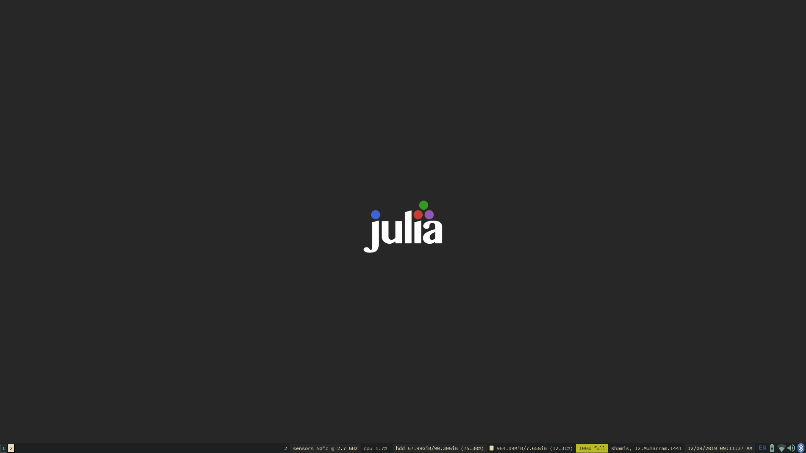

# i3dots
My Xubuntu i3 setup.

## Goals:
+ Simple and functional.
+ (mostly) no bloat.
+ Easy on the eyes.
+ No extensive ricing.
+ A distraction free environment for my works.

## Requirements:
+ i3-gaps
+ solarc gtk theme
+ zsh + ohmyzsh + P9K
+ bumblebee-status

## To-Do:
- [ ] Create a bash script for automatically setting up the environment.

Looks something like this (changes a lot):

